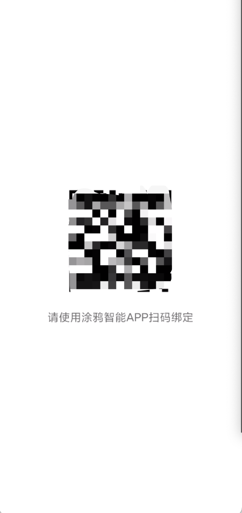
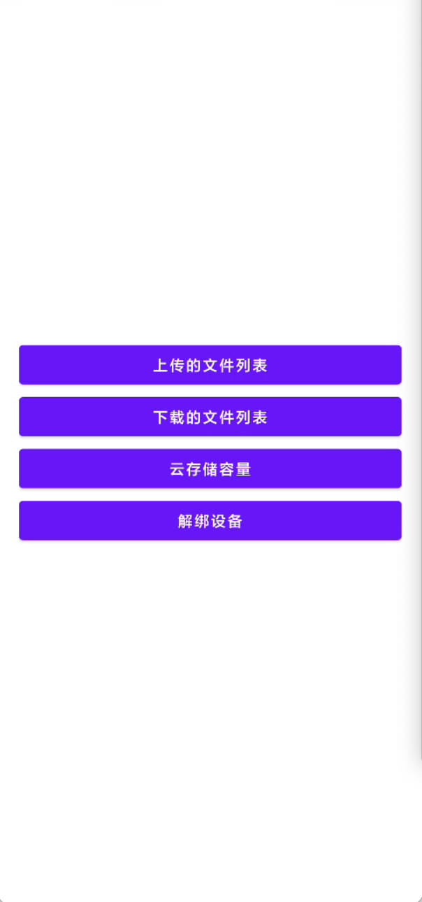
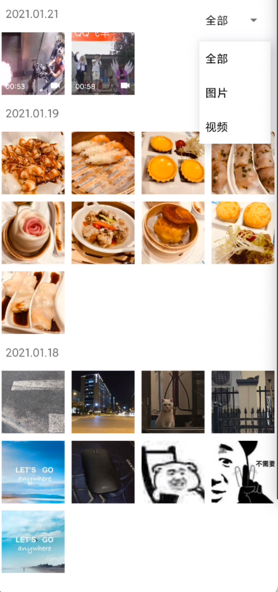
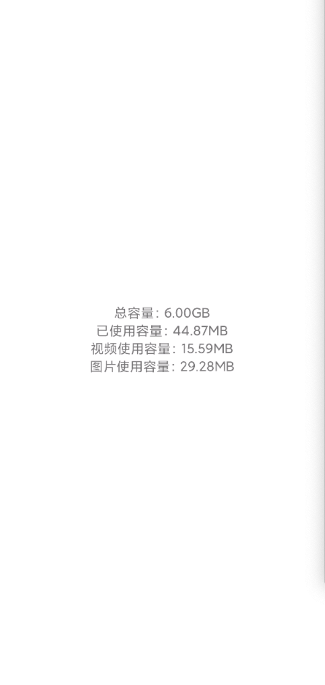

# tuya-iotos-android-photoframe-demo

中文文档 ｜ [English Wiki](README.md)

涂鸦云相框SDK Android Demo

## 功能概述

云相框SDK基于[涂鸦安卓IoT SDK](https://github.com/tuya/tuya-iotos-android-iot-demo)开发，具备获取云端图片视频、云端图片视频下载和获取云存储容量的能力。最低支持Android API 19版本。

## 准备工作

### 1.注册开发者账号

前往[涂鸦智能开发平台](https://iot.tuya.com/)注册开发者账号。

### 2.创建云相框品类产品，获取pid，uuid，key

#### 2.1 点击创建产品-教育娱乐-云相框，完善好产品信息，再点击创建产品按钮。

#### 2.2 进入到第三步硬件开发，选择对接方案及对应SDK，并可免费领取10个激活码。

#### 2.3 交付方式选择授权码清单，点击提交订单。


## Demo App

Demo App 主要对于云相框SDK的API功能进行演示，大体包括设备激活，
文件列表展示，文件下载，云端容量获取和设备解绑等功能。


用Android Studio将Demo工程打开后，将你事先申请好的pid，uuid和key填写到`AndroidManifest.xml`对应的标签中


然后运行Demo可以看到以下效果

 
 



## SDK接入指南

### 1.创建工程

在Android Studio 中新建工程。

### 2.配置build.gradle

在项目根目录的build.gradle中配置仓库地址

```groovy
allprojects {
    repositories {
        google()
        jcenter()
        maven { url 'https://dl.bintray.com/tuyasmartai/sdk' }
    }
}
```

在app目录下的build.gradle中配置SDK依赖

```groovy
android {
    defaultConfig {
        ndk {
            abiFilters "armeabi-v7a"
        }
    }
    packagingOptions {
        pickFirst 'lib/armeabi-v7a/libc++_shared.so' // 多个aar存在此so，需要选择第一个
    }
}
dependencies {
    implementation 'com.tuya.smart:photo-frame:1.0.0'

    // 涂鸦IoT SDK相关依赖
    implementation 'com.tuya.smart:tuyasmart-iot_sdk:1.1.0' 
    implementation 'com.tencent.mars:mars-xlog:1.2.3'
}
```
> 注意： </br>由于云相框SDK是基于涂鸦Android IoT SDK能力开发，所以需要将涂鸦Android IoT SDK依赖进去，关于涂鸦Android IoT SDK的更多功能介绍可以前往[GitHub](https://github.com/tuya/tuya-iotos-android-iot-demo/blob/main/README_cn.md)查看。

### 3.权限配置

```xml
<uses-permission android:name="android.permission.INTERNET" />
```

### 4.混淆配置

```
-keep class com.tuya.smart.android.photoframe.**{*;}
-dontwarn com.tuya.smart.android.photoframe.**
-keep class com.tuya.smartai.iot_sdk.** {*;}
-keep class com.tencent.mars.** {*;}
```
### 5.初始化SDK

在Application中进行初始化配置：

```
 TuyaPhotoFrame.getInstance()
                .setIoTManager(IoTSDKManager ioTSDKManager) //必须设置！建议全局维护一个IoTSDKManager单例传入
                .init(this);
```

## SDK API

### 获取云存储容量

</br>

**使用以下接口来获取云存储容量**
```java
TuyaPhotoFrame.newRequest().getCapacity(String deviceId , ITuyaResultCallback<Capacity> callback);
```

**参数说明**

| 参数    | 说明          |
| ---- | ---- |
| deviceId | 设备id，通过IoTSDKManager的getDeviceId()函数获取 |
| callback   | 回调 |

</br>

**示例代码**


```java
TuyaPhotoFrame.newRequest().getCapacity("deviceId", new ITuyaResultCallback<Capacity>() {
    
            @Override
            public void onSuccess(Capacity capacity) {
                
            }

            @Override
            public void onError(String errorCode, String errorMessage) {

            }
        });
```
**Capacity字段属性**

字段名 | 类型 | 备注
:-|:-:|:-:|:-
totalCapacity | long  | 总容量大小
usedCapacity | long  | 已使用容量大小
imageUsedCapacity | long  | 图片使用容量大小
videoUsedCapacity | long  | 视频使用容量大小

</br>

### 获取全部类型的文件列表

</br>

**使用以下接口来获取全部类型的文件列表**
```java
TuyaPhotoFrame.newRequest().getUploadedFileList(int limit , int offset , int width , int height , ITuyaResultCallback<PageInfo> callback);
```

**参数说明**

| 参数    | 说明          |
| ---- | ---- |
| limit | 一次最大条数 |
| offset   | 偏移量 |
| width   | 缩略图的宽度 |
| height   | 缩略图的高度 |

</br>

**示例代码**

```java
TuyaPhotoFrame.newRequest().getUploadedFileList(20, 0, 400, 400, new ITuyaResultCallback<PageInfo>() {

            @Override
            public void onSuccess(PageInfo pageInfo) {
                
            }

            @Override
            public void onError(String errorCode, String errorMessage) {

            }
        });
```
**PageInfo字段属性**

字段名 | 类型 | 备注
:-|:-:|:-:|:-
offset | int  | 偏移量
hasNext | boolean  | 是否有下一页
totalCount | long  | 总数量
datas | List<DateInfo>  | 日期列表，见`DateInfo`字段属性

</br>

**DateInfo字段属性**

字段名 | 类型 | 备注
:-|:-:|:-:|:-
date | long  | 上传的时间戳
list | List  | 文件列表，见`FileInfo`字段属性

</br>

**FileInfo字段属性**

字段名 | 类型 | 备注
:-|:-:|:-:|:-
devId | String  | 设备id
size | long  | 文件大小
id | long  | 文件id
type | String  | 文件类型:"image","video"
title | long  | 文件标题
duration | long  | 视频时长，当type为“video”时该字段才有效
fileUrl | long  | 缩略图url

</br>

### 获取指定类型的文件列表

</br>

**使用以下接口来获取指定类型的文件列表**
```java
TuyaPhotoFrame.newRequest().getUploadedFileListWithType(int limit , int offset , int width , int height , String type , ITuyaResultCallback<PageInfo> callback);
```

**参数说明**

| 参数    | 说明          |
| ---- | ---- |
| limit | 一次最大条数 |
| offset   | 偏移量 |
| width   | 缩略图的宽度 |
| height   | 缩略图的高度 |
| type   | 文件类型:"image"或“video” |

</br>

**示例代码**

```java
// 请求图片列表
TuyaPhotoFrame.newRequest().getUploadedFileListWithType(20, 0, 400, 400, "image", new ITuyaResultCallback<PageInfo>() {

            @Override
            public void onSuccess(PageInfo pageInfo) {
                
            }

            @Override
            public void onError(String errorCode, String errorMessage) {

            }
        });

// 请求视频列表
TuyaPhotoFrame.newRequest().getUploadedFileListWithType(20, 0, 400, 400, "video", new ITuyaResultCallback<PageInfo>() {

            @Override
            public void onSuccess(PageInfo pageInfo) {
                
            }

            @Override
            public void onError(String errorCode, String errorMessage) {

            }
        });
```

### 下载文件

</br>

**使用以下接口来下载文件**

```java
TuyaPhotoFrame.newRequest().getDownload(long id, String downloadPath, String type);
```

**参数说明**

| 参数    | 说明          |
| ---- | ---- |
| id | 文件id |
| downloadPath   | 下载路径。如果不是应用专属路径，需要自行申请读写权限，可以参考[数据和文件存储概览](https://developer.android.google.cn/training/data-storage#scoped-storage)|
| type   | 文件类型："image","video" |

</br>


**示例代码**

```java
public class DownloadActivity extends AppCompatActivity {

    BroadcastReceiver mReceiver = new BroadcastReceiver() {
        @Override
        public void onReceive(Context context, Intent intent) {
            if (intent.getAction().equals(ISchedulers.PHOTO_FRAME_DOWNLOAD_INFO_ACTION)) {
                int state = intent.getIntExtra(ISchedulers.DOWNLOAD_STATE, -1);
                switch (state) {
                    // 下载开始
                    case ISchedulers.START:
                        int taskId = intent.getIntExtra(ISchedulers.DOWNLOAD_TASK_ID, -1);
                        // taskId为文件id
                        Log.d("DownloadActivity", "taskId: "+taskId);
                        break;
                    //下载中
                    case ISchedulers.RUNNING:
                        long progress = intent.getLongExtra(ISchedulers.DOWNLOAD_PROGRESS, -1);
                        long totalSize = intent.getLongExtra(ISchedulers.DOWNLOAD_TOTAL_SIZE, -1);
                        // 下载进度和文件大小
                        Log.d("DownloadActivity", "progress: " + progress + ", totalSize: " + totalSize);
                        break;
                    //下载完成
                    case ISchedulers.COMPLETE:
                        String filePath = intent.getStringExtra(ISchedulers.DOWNLOAD_COMPLETE_PATH);
                        // 下载完成后的文件路径
                        Log.d("DownloadActivity", "filePath: " + filePath);
                        break;
                    //下载失败
                    case ISchedulers.ERROR:
                        String errorCode = intent.getStringExtra(ISchedulers.DOWNLOAD_ERROR_CODE);
                        String errorMessage = intent.getStringExtra(ISchedulers.DOWNLOAD_ERROR_MESSAGE);
                        // 下载失败的错误码和错误信息
                        Toast.makeText(context, "errorCode: " + errorCode + " ,errorMessage: " + errorMessage, Toast.LENGTH_SHORT).show();
                        break;
                    default:
                        break;
                }
            }
        }
    };

    @Override
    protected void onCreate(@Nullable Bundle savedInstanceState) {
        super.onCreate(savedInstanceState);
        setContentView(R.layout.activity_download);

        // 如果需要获取下载相关的状态，就进行广播的注册
        registerReceiver(mReceiver, new IntentFilter(ISchedulers.PHOTO_FRAME_DOWNLOAD_INFO_ACTION));

        TuyaPhotoFrame.newRequest().getDownload(id,getExternalFilesDir(""),"video");
    }

    @Override
    protected void onDestroy() {
        super.onDestroy();
        // 如果注册了广播，务必一定要记得注销
        if (mReceiver != null) {
            unregisterReceiver(mReceiver);
        }
    }
}
```

- 获取任务信息

字段名 | 说明 | 使用
:-|:-:|:-:|:-
ISchedulers.PHOTO_FRAME_DOWNLOAD_INFO_ACTION | 广播接收器Action,用于注册广播  | 
ISchedulers.DOWNLOAD_STATE | 获取任务状态  | int类型，任务状态见下表
ISchedulers.DOWNLOAD_TASK_ID | 获取任务id  | int类型
ISchedulers.DOWNLOAD_COMPLETE_PATH | 获取下载完成的路径  | String类型，只有在ISchedulers.COMPLETE状态下才能取到该值
ISchedulers.DOWNLOAD_PROGRESS | 获取下载进度  | long类型，0-100，只有在ISchedulers.RUNNING状态下才能取到该值
ISchedulers.DOWNLOAD_TOTAL_SIZE | 获取下载文件大小  | long类型，只有在ISchedulers.RUNNING状态下才能取到该值
ISchedulers.DOWNLOAD_ERROR_CODE | 获取错误码  | String类型，只有在ISchedulers.ERROR状态下才能取到该值
ISchedulers.DOWNLOAD_ERROR_MESSAGE | 获取错误信息  | String类型，只有在ISchedulers.ERROR状态下才能取到该值

</br>

- 任务状态

字段名 | 数值 | 说明
:-|:-:|:-:|:-
ISchedulers.START | 0 |  任务开始
ISchedulers.RUNNING | 1  | 任务进行中
ISchedulers.COMPLETE | 2  | 任务完成
ISchedulers.ERROR | 3  | 任务失败

</br>

### 取消下载

</br>

```java
TuyaPhotoFrame.newRequest().cancelDownload(long id);
```


**参数说明**


| 参数    | 说明          |
| ---- | ---- |
| id | 文件id |


</br>


## 错误码对照表

| 错误码    | 描述          |
| ---- | ---- |
| -6656 | 路由器断开 |
| -6657 | 设备未绑定 |
| -4354 | 构造整个URL错误 |
| -4362 | 接收数据错误 |
| -4366 | TOKEN过期 |
| -4372 | API版本错误 |
| -4373 | 设备已移除 |
| -4374 | 设备已经绑定 |
| -4375 | 无法识别API |
| -4376 | 字符串格式化错误 |
| -4378 | 服务端校验失败 |
|-2049 | URL长度超出限制 |
|-2050 | 系统错误 |
|-2051 | 准备请求错误 |
|-2052 | 发送请求错误 |
|-2053 | 读取错误 |
|-2054 | 添加头错误 |
|-2055 | 获取应答错误 |
|-2060 | 创建HTTP URL头错误 |
|-2061 | HTTPS句柄错误 |
|-2062 | HTTPS无效应答 |
|-2063 | 不支持断点续传 |
| 3001 | json数据解析异常 |
| 3100 | 其他错误 |

<br>

## 版本更新记录

[CHANGELOG.md](CHANGELOG-zh.md)