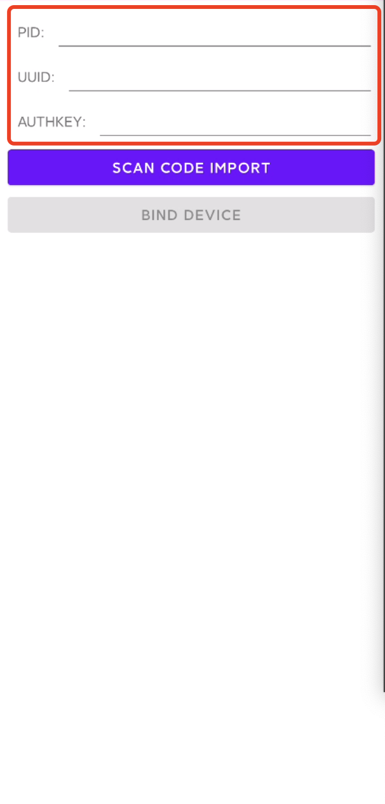

# Tuya Photo Frame Demo for Android

[中文文档](README-zh.md) | English

Tuya Photo Frame Demo for Android

## Overview

Tuya Photo Frame SDK for Android is developed based on [Tuya Android IoT SDK](https://github.com/tuya/tuya-iotos-android-iot-demo) and has the ability to obtain and download cloud image and video and get cloud storage capacity. Support Android 4.4 (API level 19) or above.

## Preparation

1. Register a Tuya account

    Go to the [Tuya IoT Platform](https://iot.tuya.com/) to register an account.

2. Create a cloud frame product to get PID, UUID, and key.

    - Click Create > Entertainment > Cloud Frame, complete the product information, and then click Create Product.

    

    - Click Hardware Development tab, select the connection mode and SDK, then get 10 free licenses.

    

    - Select License List for Delivery from, and then click Submit the order.

    
    
3. Firmware Configuration

    The current SDK has mandatory requirements for firmware, and custom firmware must be added to the platform in order to activate it. The specific process is as follows.

    - In Hardware Development > Select Firmware , and click Add Custom Firmware.
    
    
    
    - Fill in the firmware information with the following reference. Where the firmware type must be selected as module firmware. Other fill in according to the actual situation.
    
    
    
## Demo App

Demo app demonstrates the API functions of Tuya Photo Frame SDK, which includes device activation, file list display, file download, cloud capacity acquisition, device unbinding, and more.

[install package experience](./apk/tuya_photo_frame.apk).

> Note: Before starting, you need to configure the `PID`, `UUID` and `AUTHKEY`

1. Run the demo app, then edit in the configuration page.

    

2. Generate the configuration QR code, scan the code when you run the demo app and click the "SCAN CODE IMPORT" button.

      

   QR code generation method: Use a [QR generation tool](https://cli.im/text) and the following configuration json to generate a QR code.
```json
{
    "PID": "Your PID",
    "UUID": "Your UUID",
    "AUTHKEY": "your AUTHKEY"
}
```

3. Open the demo project in Android Studio and set PID, UUID and key in the `AndroidManifest.xml` file, then run the demo app.

  

Click the "BIND DEVICE" button , the successful operation result is shown as follows.

 
 


## Integrate SDK

### 1. Create project

Build your project in the Android Studio.

### 2. Configure build.gradle

Add the following code to the `build.gradle` file in the project root directory.

```groovy
allprojects {
    repositories {
        google()
        jcenter()
        maven { url 'https://dl.bintray.com/tuyasmartai/sdk' }
    }
}
```
Add the following codes to the `build.gradle` file in the app folder.

```groovy
android {
    defaultConfig {
        ndk {
            abiFilters "armeabi-v7a"
        }
    }
    packagingOptions {
        pickFirst 'lib/armeabi-v7a/libc++_shared.so' // Multiple .aar files exist for this .so file. Select the first one
    }
}
dependencies {
    implementation 'com.tuya.smart:photo-frame:1.0.0'

    // Tuya IoT SDK dependencies
    implementation 'com.tuya.smart:tuyasmart-iot_sdk:1.1.0' 
    implementation 'com.tencent.mars:mars-xlog:1.2.3'
}
```
> Tips: </br> Since the Tuya Photo Frame SDK is based on the Tuya Android IoT SDK capabilities, you need to include the Tuya Android IoT SDK dependencies. For more information about the Tuya Android IoT SDK, go to [GitHub](https://github.com/tuya/tuya-iotos-android-iot-demo) and check it out.

### 3. Configure permission 

```xml
<uses-permission android:name="android.permission.INTERNET" />
```

### 4. Proguard configuration

```
-keep class com.tuya.smart.android.photoframe.**{*;}
-dontwarn com.tuya.smart.android.photoframe.**
-keep class com.tuya.smartai.iot_sdk.** {*;}
-keep class com.tencent.mars.** {*;}
```
### 5. Initialize SDK

Initialize the configuration in `Application`.

```
 TuyaPhotoFrame.getInstance()
                .setIoTManager(IoTSDKManager ioTSDKManager) // It must be set. It is recommended to maintain a single instance of IoTSDKManager
                .init(this);
```

## SDK API

### Get cloud storage capacity

</br>

**Get the cloud storage capacity using the following API**
```java
TuyaPhotoFrame.newRequest().getCapacity(String deviceId , ITuyaResultCallback<Capacity> callback);
```

**Parameter description**

| Parameter    | Description      |
| ---- | ---- |
| deviceId | Device ID, obtained by `getDeviceId()` function of `IoTSDKManager` |
| callback   | Callback |

</br>

**Sample code**


```java
TuyaPhotoFrame.newRequest().getCapacity("deviceId", new ITuyaResultCallback<Capacity>() {
    
            @Override
            public void onSuccess(Capacity capacity) {
                
            }

            @Override
            public void onError(String errorCode, String errorMessage) {

            }
        });
```
**Capacity field property**

| Field Name | Type | Remarks |
| ---- | ---- | ---- |
| totalCapacity | long  | Total cloud storage |
| usedCapacity | long  | Cloud storage used |
| imageUsedCapacity | long  | Cloud storage used for storing images |
| videoUsedCapacity | long  | Cloud storage used for storing videos |

</br>

### Get a list of all types of files

</br>

**Get a list of types of files using the following API**
```java
TuyaPhotoFrame.newRequest().getUploadedFileList(int limit , int offset , int width , int height , ITuyaResultCallback<PageInfo> callback);
```

**Parameter Description**

| Parameter    | Description          |
| ---- | ---- |
| limit | Maximum number of items at a time |
| offset   | Offset |
| width   |  Thumbnail width |
| height   | Thumbnail height |

</br>

**Sample code**

```java
TuyaPhotoFrame.newRequest().getUploadedFileList(20, 0, 400, 400, new ITuyaResultCallback<PageInfo>() {

            @Override
            public void onSuccess(PageInfo pageInfo) {
                
            }

            @Override
            public void onError(String errorCode, String errorMessage) {

            }
        });
```
**PageInfo field property**

| Field Name | Type | Remarks |
| ---- | ---- | ---- |
| offset | int  | Offset |
| hasNext | boolean  | Whether there is a next page |
| totalCount | long  |  Total count |
| datas | List<DateInfo>  |  List of dates, see the `DateInfo` field property |

</br>

**DateInfo field property**

| Field Name | Type | Remarks |
| ---- | ---- | ---- |
| date | long  | Timestamp of the upload |
| list | List  | List of files, see the `FileInfo` field property |

</br>

**FileInfo field property**

| Field Name | Type | Remarks |
| ---- | ---- | ---- |
| devId | String  | Device ID |
| size | long  | File size |
| id | long  | File ID |
| type | String  |  File type: "image", "video" |
| title | long  | Title of the file |
| duration | long  |  The duration of the video, valid only when type is "video" |
| fileUrl | long  | Thumbnail URL |

</br>

### Get a list of files of the specified type

</br>

**Get a list of files of the specified type using the following api**
```java
TuyaPhotoFrame.newRequest().getUploadedFileListWithType(int limit , int offset , int width , int height , String type , ITuyaResultCallback<PageInfo> callback);
```

**Parameter description**

| Parameter    | description          |
| ---- | ---- |
| limit | Maximum number of items at a time |
| offset   | Offset |
| width   | Width of the thumbnail |
| height   |  Height of the thumbnail |
| type   | File type: "image" or "video"  |

</br>

**Sample code**

```java
// Request Image List
TuyaPhotoFrame.newRequest().getUploadedFileListWithType(20, 0, 400, 400, "image", new ITuyaResultCallback<PageInfo>() {

            @Override
            public void onSuccess(PageInfo pageInfo) {
                
            }

            @Override
            public void onError(String errorCode, String errorMessage) {

            }
        });

// Request Video List
TuyaPhotoFrame.newRequest().getUploadedFileListWithType(20, 0, 400, 400, "video", new ITuyaResultCallback<PageInfo>() {

            @Override
            public void onSuccess(PageInfo pageInfo) {
                
            }

            @Override
            public void onError(String errorCode, String errorMessage) {

            }
        });
```

### Download files

</br>

**Use the following API to download files**

```java
TuyaPhotoFrame.newRequest().getDownload(long id, String downloadPath, String type);
```

**Parameter description**

| Parameter | Description |
| ---- | ---- |
| id | File ID |
| downloadPath   | The download path. If it is not an app-specific path, you need to apply for read/write permission by yourself. You can refer to [Data and file storage overview](https://developer.android.google.cn/training/data-storage#scoped-storage)|
| type   |  File types: "image", "video" |

</br>


**Sample code**

```java
public class DownloadActivity extends AppCompatActivity {

    BroadcastReceiver mReceiver = new BroadcastReceiver() {
        @Override
        public void onReceive(Context context, Intent intent) {
            if (intent.getAction().equals(ISchedulers.PHOTO_FRAME_DOWNLOAD_INFO_ACTION)) {
                int state = intent.getIntExtra(ISchedulers.DOWNLOAD_STATE, -1);
                switch (state) {
                    // Start downloading
                    case ISchedulers.START:
                        int taskId = intent.getIntExtra(ISchedulers.DOWNLOAD_TASK_ID, -1);
                        // taskId is the file id
                        Log.d("DownloadActivity", "taskId: "+taskId);
                        break;
                    // Downloading
                    case ISchedulers.RUNNING:
                        long progress = intent.getLongExtra(ISchedulers.DOWNLOAD_PROGRESS, -1);
                        long totalSize = intent.getLongExtra(ISchedulers.DOWNLOAD_TOTAL_SIZE, -1);
                        // Download progress and file size
                        Log.d("DownloadActivity", "progress: " + progress + ", totalSize: " + totalSize);
                        break;
                    //Download completed
                    case ISchedulers.COMPLETE:
                        String filePath = intent.getStringExtra(ISchedulers.DOWNLOAD_COMPLETE_PATH);
                        // File path after download is completed
                        Log.d("DownloadActivity", "filePath: " + filePath);
                        break;
                    // Download failed
                    case ISchedulers.ERROR:
                        String errorCode = intent.getStringExtra(ISchedulers.DOWNLOAD_ERROR_CODE);
                        String errorMessage = intent.getStringExtra(ISchedulers.DOWNLOAD_ERROR_MESSAGE);
                        // Error code and error message for download failure
                        Toast.makeText(context, "errorCode: " + errorCode + " ,errorMessage: " + errorMessage, Toast.LENGTH_SHORT).show();
                        break;
                    default:
                        break;
                }
            }
        }
    };

    @Override
    protected void onCreate(@Nullable Bundle savedInstanceState) {
        super.onCreate(savedInstanceState);
        setContentView(R.layout.activity_download);

          // If you need to get the download-related state, please registerReceiver
        registerReceiver(mReceiver, new IntentFilter(ISchedulers.PHOTO_FRAME_DOWNLOAD_INFO_ACTION));

        TuyaPhotoFrame.newRequest().getDownload(id,getExternalFilesDir(""),"video");
    }

    @Override
    protected void onDestroy() {
        super.onDestroy();
        // If you have registered a broadcast, make sure to unregister Receiver
        if (mReceiver != null) {
            unregisterReceiver(mReceiver);
        }
    }
}
```

- Get download task information

| Field Name | Description | Use |
| ---- | ---- | ---- |
| ISchedulers.PHOTO_FRAME_DOWNLOAD_INFO_ACTION | Broadcast receiver Action, used to register a broadcast  |
| ISchedulers.DOWNLOAD_STATE |  Get task status   |  int type, see the following table for task status |
| ISchedulers.DOWNLOAD_TASK_ID | Get task ID  |  int type |
| ISchedulers.DOWNLOAD_COMPLETE_PATH | Get the path where the download is completed  | String type, only be retrieved in ISchedulers.COMPLETE |
| ISchedulers.DOWNLOAD_PROGRESS | Get the download progress  |  long type, 0-100, only be retrieved in ISchedulers.RUNNING |
| ISchedulers.DOWNLOAD_TOTAL_SIZE | Get file size  |  long type, only be retrieved in ISchedulers.RUNNING |
| ISchedulers.DOWNLOAD_ERROR_CODE |  Get error code   | String type, only be retrieved in ISchedulers.ERROR |
| ISchedulers.DOWNLOAD_ERROR_MESSAGE | Get error message | String type, only be retrieved in ISchedulers.ERROR  |

</br>

- Task Status

| Field Name | Value | Description |
| ---- | ---- | ---- |
| ISchedulers.START | 0 |  Task start |
| ISchedulers.RUNNING | 1  | Task in progress |
| ISchedulers.COMPLETE | 2  | Task completed |
| ISchedulers.ERROR | 3  | Task failed |

</br>

### Cancel download

</br>

```java
TuyaPhotoFrame.newRequest().cancelDownload(long id);
```


**Parameter description**


| Parameter | Description |
| ---- | ---- |
| id | File ID |


</br>


## Error Code

| Error code | Description |
| ---- | ---- |
| -6656 | Disconnected with router |
| -6657 | Device is not bound |
| -4354 | Full URL construction error |
| -4362 | Receiver error |
| -4366 | API token expired |
| -4372 | API version wrong |
| -4373 | Device is removed |
| -4374 | Device is already bound |
| -4375 | Unknown API error |
| -4376 | Formatting string failed |
| -4378 | Service verification failed |
|-2049 | HTTP URL length exceeds limit |
|-2050 | System error |
|-2051 | HTTP prepare request error |
|-2052 | HTTP send request error |
|-2053 | HTTP read error |
|-2054 | HTTP head adding error |
|-2055 | HTTP get response error |
|-2060 | HTTP URL head creation error |
|-2061 | HTTPS handle error |
|-2062 | HTTPS response invalid |
|-2063 | Not support range |
| 3001 | JSON parse error |
| 3100 | Other error |

## ChangeLog
[CHANGELOG.md](CHANGELOG.md)

## Support

You can get support from Tuya with the following methods:

Tuya Smart Help Center: https://support.tuya.com/en/help

Technical Support: https://service.console.tuya.com

## License

This Tuya Photo Frame SDK is licensed under the MIT License.
